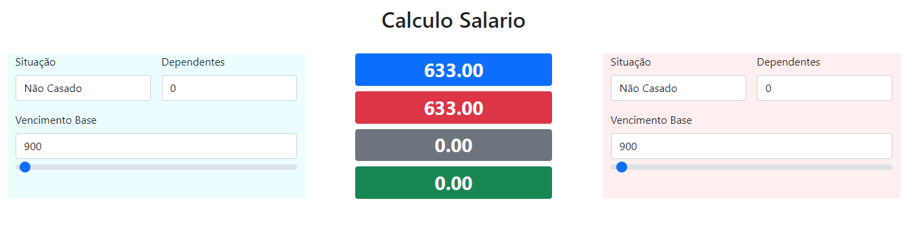

Project built with vanilla Javascript to compare two portuguese salaries side by side. 

-  **Blue** label shows the Net salary from blue form (Left)  
-  **Red** label shows the Net salary from red form (Right)  
-  **Grey**  label shows the Gross difference between the two salaries  
-  **Green** label show the Net difference between the two salaries

Double click on Blue label values are copied from left to right, double click in Red label and values are copied the other way around.
